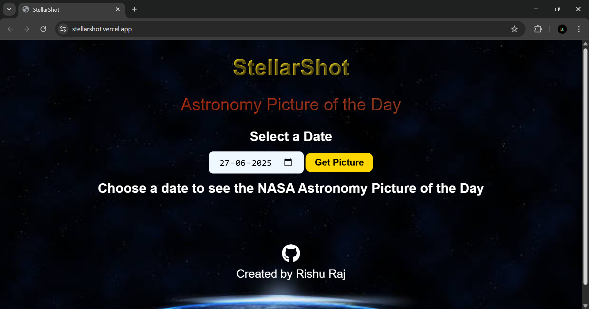

# 🌌 StellarShot - NASA Picture of the Day Viewer

**StellarShot** is a simple and elegant website that displays NASA's Astronomy Picture of the Day (APOD) using NASA's public API. Built with HTML, CSS, and JavaScript, it allows users to explore space imagery along with detailed descriptions provided by NASA.

## 🚀 Features

- 🔭 Fetches NASA's Astronomy Picture of the Day dynamically
- 📅 Allows viewing images for specific dates
- 🌠 Displays high-definition images or videos with explanations
- 🎨 Responsive and visually appealing design
- 📅 Automatically shows today’s APOD on load

## 🛠️ Tech Stack

- **HTML5**
- **CSS3**
- **JavaScript (Vanilla JS)**
- **NASA APOD API**

## 📸 Screenshot

  
*Add a real screenshot of your site here*

## 📡 Getting Started

To run the project locally:

1. Clone the repository:
   ```bash
   git clone https://github.com/rishuraj1708/StellarShot.git
